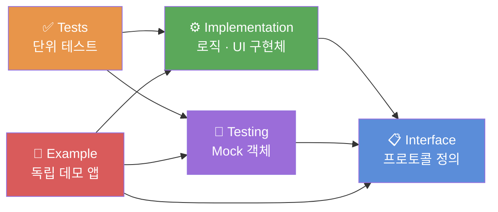
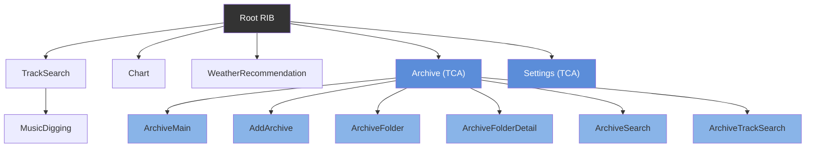
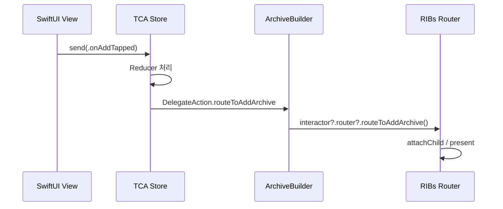

# MusicSearch

음악 검색, 차트, 날씨 기반 추천 기능이 포함된 iOS 애플리케이션.

---

## 🧾 목차

- [📱 실행 화면](#-실행-화면)
- [✨ 주요 기능](#-주요-기능)
- [📂 아키텍처 및 폴더 구조](#-아키텍처-및-폴더-구조)
- [🛠 기술 스택](#-기술-스택)
- [🚀 주요 구현](#-주요-구현)

---

## 📱 실행 화면

| Weather | Search | Chart | Archive |
| :---: | :---: | :---: |:---: |
|  |  |  |  |

---

## ✨ 주요 기능

| 구분 | 기능 |
| --- | --- |
| **음악 검색** | Spotify API 연동 트랙 검색. 무한 스크롤, 디바운스 적용 |
| **보관함 (Archive)** | 트랙 폴더화 저장 (SwiftData). 저장 트랙 Spotify 플레이리스트 내보내기 지원 |
| **음악 디깅** | 선택 트랙과 유사한 곡을 Child RIB으로 연속 탐색 |
| **날씨 추천** | 현재 위치 날씨 데이터 기반 추천 음악 태그 추출 및 트랙 표시 |
| **차트** | 트랙 및 아티스트 차트 제공 |

---

## 📂 아키텍처 및 폴더 구조

Tuist Workspace 기반 3계층(App, Core, Features) 분리 구조.

```text
MusicSearch.xcworkspace
├── MusicSearch/App                           # 진입점(Root RIB) 및 리소스
├── MusicSearch/Core                          # 공통 모듈
│   ├── MSDesignSystem                        # 공용 디자인 컴포넌트
│   ├── MSDomain                              # 공용 Entity, UseCase, Interface
│   ├── MSInfrastructure                      # Networking, Repository 구현체
│   ├── MSUtil                                # 공용 유틸리티 (Kingfisher 포함)
│   └── MSTesting                             # 공용 Mock 객체
└── MusicSearch/Features                      # 비즈니스 로직 단위 피처 모듈
    ├── Archive (RIBs + TCA)                  # 보관함 — 6개 서브 피처
    │   ├── ArchiveMain                       # 보관함 메인
    │   ├── AddArchive                        # 트랙 추가
    │   ├── ArchiveFolder                     # 폴더 목록
    │   ├── ArchiveFolderDetail               # 폴더 상세
    │   ├── ArchiveSearch                     # 보관함 내 검색
    │   └── ArchiveTrackSearch                # 트랙 검색 (보관함 전용)
    ├── Chart (RIBs)
    ├── MusicDigging (RIBs)
    ├── Settings (RIBs + TCA)
    ├── TrackSearch (RIBs)
    └── WeatherRecommendation (RIBs)
```

### Micro-Feature 분할
각 피처 모듈은 5개 타겟으로 분리.
- `Interface`: 프로토콜(Dependency) 정의
- `Implementation`: 로직 및 UI 구현체
- `Testing`: Mock 객체 모음
- `Tests`: 단위 테스트
- `Example`: 독립 데모 앱

**타겟 구조 및 의존 방향**



**RIBs 라우팅 트리**



---

## 🛠 기술 스택

| Category | Stack |
| --- | --- |
| **Language** | Swift |
| **Architecture** | TMA(Tuist Micro-Feature Architecture), RIBs, TCA |
| **Build System** | Tuist |
| **Concurrency** | Swift Concurrency (`async`/`await`) |
| **Local DB** | SwiftData |
| **UI Design** | SwiftUI, UIKit |
| **Networking** | URLSession 기반 커스텀 NetworkLayer |
| **Testing/Demo** | Swift Testing, TCA TestStore, Mock 주입 Demo 앱 |
| **Open API** | Spotify API, OpenWeatherMap, Last.fm |
| **External Libraries** | MicroRIBs, NetworkLayer, ComposableArchitecture, Kingfisher |

---

## 🚀 주요 구현

### 1. 관심사 분리와 피처 모듈화 (Tuist + Micro-Feature)
- **설계 의도:** 처음부터 모듈화를 목표로 한 것이 아니라, 프로토콜 중심으로 관심사를 분리하고 테스터빌리티를 높이는 구조를 지향했음. `Interface` 타겟에 프로토콜을 정의하고 `Implementation` 타겟에서 이를 구현하는 방식으로 의존성 방향을 통제함.
- **모듈화의 도입:** 위의 설계 덕분에 타겟 간 결합도가 이미 낮아져 있었고, 이를 기반으로 Tuist를 활용해 프로젝트를 3계층(App, Core, Features)과 피처당 5개 타겟으로 물리적으로 분리함.
- **결과:** 모듈 간 의존성이 명확해짐은 물론, **각 피처 모듈을 독립된 Example 앱으로 실행하고 테스트할 수 있어** 거대한 앱 전체를 빌드할 필요 없이 빠르고 쾌적한 개발 환경을 구축할 수 있게 됨.

### 2. 고립 UI 테스트 환경 (Example 앱 및 Mock 시나리오)
- **구현 기술:** 11개 피처 서브모듈의 Example 앱에 `DemoScenario`(성공, 빈 화면, 에러, 지연)를 적용하고, Mock 의존성 객체가 해당 시나리오별로 동작하도록 분기 처리.
- **도입 이유:** 1번에서 프로토콜 중심으로 의존성을 분리한 구조 덕분에, 실제 구현체 대신 Mock 객체를 손쉽게 교체 주입할 수 있게 됨. 이 구조를 활용해 실제 서버나 전체 앱 실행 없이도 빈 화면(Empty), 에러, 로딩 스켈레톤 등 UI 엣지 케이스를 즉각적으로 확인하는 고립 테스트 환경을 구축.
- **결과:** 개발 과정에서 네트워크 환경 조작 없이 모든 뷰 상태를 독립적이고 안정적으로 검증 가능.

### 3. 아키텍처 혼용 (RIBs + TCA)
- **구현 기술:** Archive 피처를 SwiftUI + TCA로 개발하고, RIBs 트리 안에 통합. 역할을 다음과 같이 명확히 분리.
  - **RIBs**: 화면 전환(Router), 생명주기(Interactor), 의존성 조립(Builder/Component)
  - **TCA**: SwiftUI 뷰의 상태 관리(State/Action/Reducer)
- **도입 이유:** Archive는 기존 피처와 별개로 SwiftUI로 구현하기로 결정했고, SwiftUI의 단방향 데이터 흐름과 TCA의 단방향 데이터 플로우가 자연스럽게 맞아 TCA를 채택.
- **브릿지 방식:** `ArchiveBuilder`에서 TCA Store와 RIBs Interactor를 함께 생성하고, TCA Reducer의 `DelegateAction`을 `onDelegate` 클로저를 통해 RIBs Router 메서드 호출로 연결. TCA Reducer는 라우팅을 전혀 알지 못하며, 화면 이동이 필요한 시점에 `DelegateAction`만 방출하고 실제 전환은 RIBs가 처리.



<details>
<summary>ArchiveBuilder.swift — 브릿지 코드 보기</summary>

```swift
// ArchiveBuilder.swift
let store = Store(initialState: ArchiveFeature.State()) {
    ArchiveFeature(
        archiveRepository: component.archiveRepository,
        onDelegate: { [weak interactor] action in   // TCA → RIBs 브릿지
            switch action {
            case .routeToAddArchive:  interactor?.router?.routeToAddArchive()
            case .routeToSearch:      interactor?.router?.routeToSearch()
            case .routeToFolder:      interactor?.router?.routeToFolder()
            case let .routeToEditArchive(track): interactor?.router?.routeToEditArchive(track: track)
            }
        }
    )
}
let viewController = ArchiveHostingController(rootView: ArchiveView(store: store), ...)
```

</details>


- **결과:** 기존 RIBs 구조를 유지하면서 SwiftUI + TCA 기반의 피처를 독립적으로 개발 및 통합할 수 있는 구조 확보.

