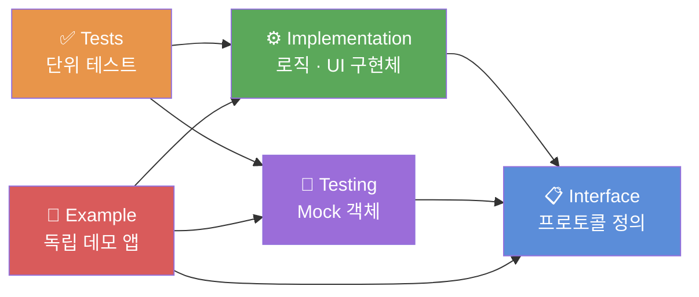
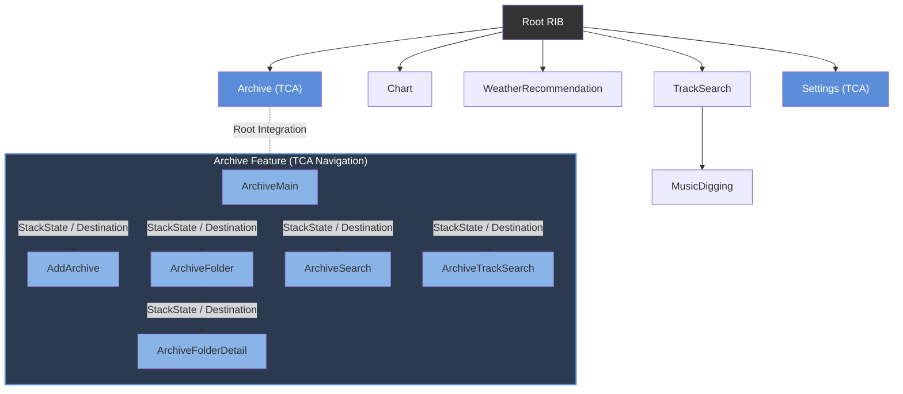
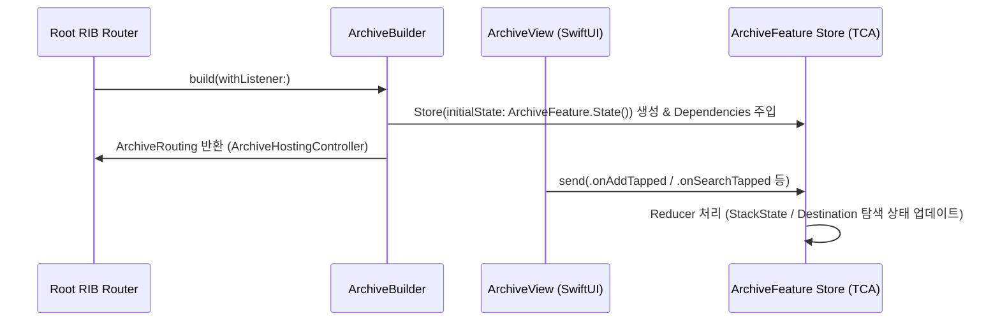

# MusicSearch

음악 검색, 차트, 날씨 기반 추천 기능이 포함된 iOS 애플리케이션.

---

## 🧾 목차

- [📱 실행 화면](#-실행-화면)
- [✨ 주요 기능](#-주요-기능)
- [📂 아키텍처 및 폴더 구조](#-아키텍처-및-폴더-구조)
- [🛠 기술 스택](#-기술-스택)
- [🚀 주요 구현](#-주요-구현)

---

## 📱 실행 화면

| Weather | Search | Chart | Archive |
| :---: | :---: | :---: |:---: |
|  |  |  |  |

---

## ✨ 주요 기능

| 구분 | 기능 |
| --- | --- |
| **음악 검색** | Spotify API 연동 트랙 검색. 무한 스크롤, 디바운스 적용 |
| **보관함 (Archive)** | 트랙 폴더화 저장 (SwiftData). 저장 트랙 Spotify 플레이리스트 내보내기 지원 |
| **음악 디깅** | 선택 트랙과 유사한 곡을 Child RIB으로 연속 탐색 |
| **날씨 추천** | 현재 위치 날씨 데이터 기반 추천 음악 태그 추출 및 트랙 표시 |
| **차트** | 트랙 및 아티스트 차트 제공 |

---

## 📂 아키텍처 및 폴더 구조

Tuist Workspace 기반 3계층(App, Core, Features) 분리 구조.

```text
MusicSearch.xcworkspace
├── MusicSearch/App                           # 진입점(Root RIB) 및 리소스
├── MusicSearch/Core                          # 공통 모듈 (Target Prefix: MS)
│   ├── Data                                  # 공용 Data Layer
│   ├── DesignSystem                          # 공용 디자인 컴포넌트 (MSDesignSystem Target)
│   ├── Domain                                # 공용 Entity, UseCase, Interface (MSDomain Target)
│   ├── Infrastructure                        # Networking, Repository 구현체 (MSInfrastructure Target)
│   ├── Util                                  # 공용 유틸리티 (Kingfisher 포함) (MSUtil Target)
│   └── Testing                               # 공용 Mock 객체 (MSTesting Target)
└── MusicSearch/Features                      # 비즈니스 로직 단위 피처 모듈
    ├── Archive (RIBs + TCA)                  # 보관함 — 6개 서브 피처 및 Shared 모듈
    │   ├── Shared                            # Archive 공통 Domain, Data, UI
    │   ├── ArchiveMain                       # 보관함 메인
    │   ├── AddArchive                        # 트랙 추가
    │   ├── ArchiveFolder                     # 폴더 목록
    │   ├── ArchiveFolderDetail               # 폴더 상세
    │   ├── ArchiveSearch                     # 보관함 내 검색
    │   └── ArchiveTrackSearch                # 트랙 검색 (보관함 전용)
    ├── Chart (RIBs)
    ├── MusicDigging (RIBs)
    ├── Settings (RIBs + TCA)
    ├── TrackSearch (RIBs)
    └── WeatherRecommendation (RIBs)
```

### Micro-Feature 분할
각 피처 모듈은 5개 타겟으로 분리.
- `Interface`: 프로토콜(Dependency) 정의
- `Implementation`: 로직 및 UI 구현체
- `Testing`: Mock 객체 모음
- `Tests`: 단위 테스트
- `Example`: 독립 데모 앱

**타겟 구조 및 의존 방향**



**RIBs 라우팅 트리**



---

## 🛠 기술 스택

| Category | Stack |
| --- | --- |
| **Language** | Swift |
| **Architecture** | Micro-Feature Architecture, RIBs, TCA |
| **Build System** | Tuist |
| **Concurrency** | Swift Concurrency (`async`/`await`) |
| **Local DB** | SwiftData |
| **UI Design** | SwiftUI, UIKit |
| **Networking** | URLSession 기반 커스텀 NetworkLayer |
| **Testing/Demo** | Swift Testing, TCA TestStore, Mock 주입 Demo 앱 |
| **Open API** | Spotify API, OpenWeatherMap, Last.fm |
| **External Libraries** | MicroRIBs, NetworkLayer, ComposableArchitecture, Kingfisher |

---

## 🚀 주요 구현

### 1. 관심사 분리와 피처 모듈화 (Tuist + Micro-Feature)
- **설계 방식:** `Interface` 타겟에 프로토콜을 정의하고 `Implementation` 타겟에서 구현하는 방식으로 의존성 방향 통제.
- **모듈 분리:** Tuist를 활용해 프로젝트를 3계층(App, Core, Features) 및 피처당 5개 타겟으로 분리.
- **결과:** 각 피처 모듈을 독립된 Example 앱으로 실행하고 테스트 가능.

### 2. 고립 UI 테스트 환경 (Example 앱 및 Mock 시나리오)
- **구현 기술:** Example 앱에 `DemoScenario`(성공, 빈 화면, 에러, 지연)를 적용하고, Mock 의존성 객체가 시나리오별로 동작하도록 분기 처리.
- **도입 목적:** 서버 연동 및 전체 앱 실행 없이 빈 화면, 에러, 로딩 등 UI 케이스를 확인하는 테스트 환경 구축.
- **결과:** 네트워크 상태 조작 없이 뷰 상태 검증 가능.

### 3. 아키텍처 혼용 (RIBs + TCA Navigation)
- **구현 기술:** Archive 피처를 SwiftUI + TCA로 개발하고 Root RIBs 트리의 엔트리 포인트로 통합.
  - **RIBs**: 최상위 쉘 및 애플리케이션 진입점 관리 (Root RIBs 트리에 Archive 조립 및 부착)
  - **TCA**: SwiftUI 뷰의 상태 관리 및 피처 내부 화면 전환 탐색 (`StackState`, `@Presents`, `Destination`, `Path`)
- **통합 방식:** `ArchiveBuilder`에서 TCA Store를 의존성과 함께 주입 및 생성하여 `ArchiveHostingController`로 반환. Archive 내부 화면 이동은 TCA Navigation (`StackState`, `@Presents`) 구조에 따라 Reducer 내부에서 처리.



<details>
<summary>ArchiveBuilder.swift — RIBs & TCA Store 조립 코드 보기</summary>

```swift
// ArchiveBuilder.swift
public func build(withListener listener: ArchiveListener) -> ArchiveRouting {
    let component = ArchiveComponent(dependency: dependency)
    let interactor = ArchiveInteractor()
    interactor.listener = listener

    let store = withDependencies {
        $0.archiveRepository = component.dependency.archiveRepository
        $0.exportPlaylistUseCase = component.dependency.exportPlaylistUseCase
        $0.getMusicAccessTokenUseCase = component.dependency.getMusicAccessTokenUseCase
        $0.authorizeMusicUseCase = component.dependency.authorizeMusicUseCase
        $0.searchTracksUseCase = component.dependency.searchTracksUseCase
    } operation: {
        Store(
            initialState: ArchiveFeature.State(),
            reducer: { ArchiveFeature() }
        )
    }

    let view = ArchiveView(store: store)
    let viewController = ArchiveHostingController(rootView: view)
    viewController.view.backgroundColor = .clear

    let router = ArchiveRouter(interactor: interactor, viewController: viewController)
    interactor.router = router
    return router
}
```

</details>

- **결과:** RIBs 애플리케이션 구조를 유지하면서 Archive 피처 내부에 SwiftUI + TCA Navigation 체계 통합.


